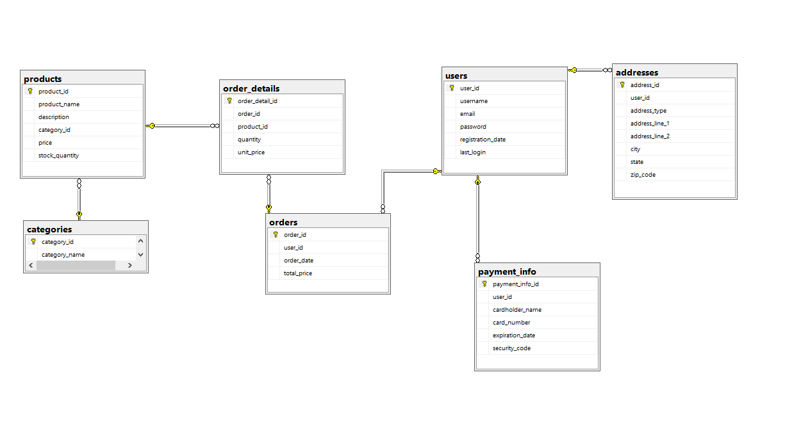

# ExamplesTSqlDatabase

Örnek E-Ticaret Sitesi Veritabanı Tasarımı

Bu proje, E-ticaret sitesinin veritabanının klonunu oluşturmak amacıyla hazırlanmıştır. Veritabanı, SQL Server kullanılarak tasarlanmıştır ve 7 adet tablodan oluşmaktadır. Bu tablolar, kullanıcılar, ürünler, kategoriler, siparişler, sipariş detayları, adresler ve ödeme bilgileri tablolarıdır.

Tablo Açıklamaları
Users Tablosu
Bu tablo, Sahibinden.com'a kayıtlı olan kullanıcıların bilgilerini tutar. Kullanıcılara ait özellikler user_id, username, email, password, registration_date ve last_login'dir.

Products Tablosu
Bu tablo, E-ticaret sitesinde satılan ürünlere ait bilgileri tutar. Ürünlere ait özellikler product_id, product_name, description, category_id, price ve stock_quantity'dir.

Categories Tablosu
Bu tablo,E-ticaret sitesinde  bulunan ürün kategorilerinin bilgilerini tutar. Kategorilere ait özellikler category_id ve category_name'dir.

Orders Tablosu
Bu tablo, kullanıcıların verdiği siparişlerin bilgilerini tutar. Siparişlere ait özellikler order_id, user_id, order_date ve total_price'dır.

Order_Details Tablosu
Bu tablo, siparişlerde bulunan ürünlere ait detay bilgilerini tutar. Detaylara ait özellikler order_detail_id, order_id, product_id ve quantity'dir.

Addresses Tablosu
Bu tablo, kullanıcıların adres bilgilerini tutar. Adreslere ait özellikler address_id, user_id, address_type, address_line_1, address_line_2, city, state ve zip_code'dur.

Payment_Info Tablosu
Bu tablo, kullanıcıların ödeme bilgilerini tutar. Ödeme bilgilerine ait özellikler payment_info_id, user_id, cardholder_name, card_number, expiration_date ve security_code'dur.

Veritabanı Diyagramı

Yukarıdaki diyagram, E-ticaret sitesinin veritabanının ilişkilerini göstermektedir. Veritabanı, Users tablosu ile diğer tüm tablolar arasında birer-manyer ilişkileri içermektedir.
